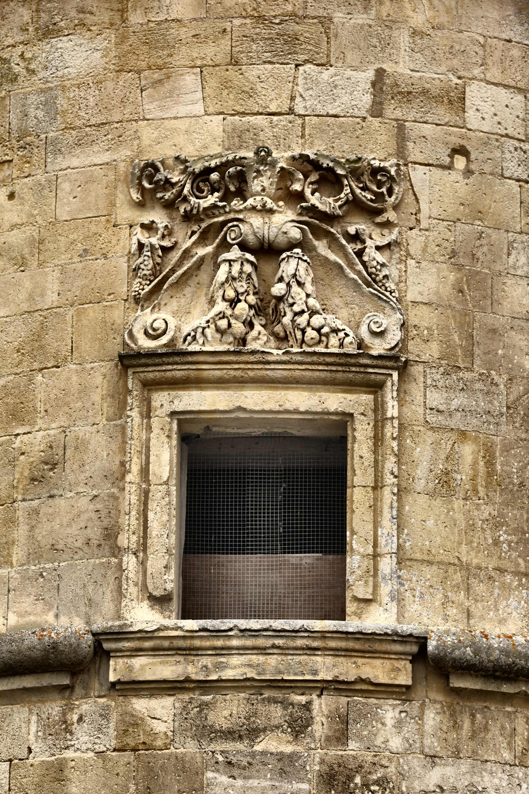
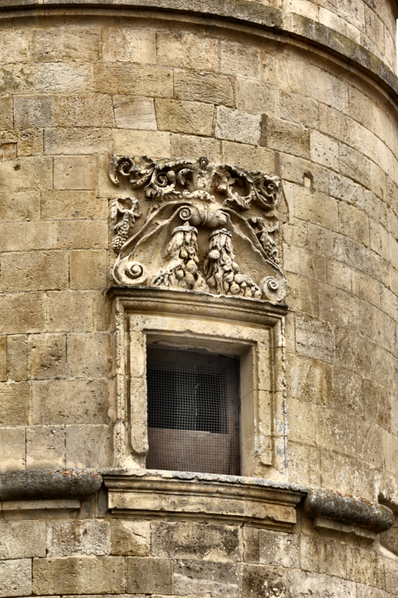
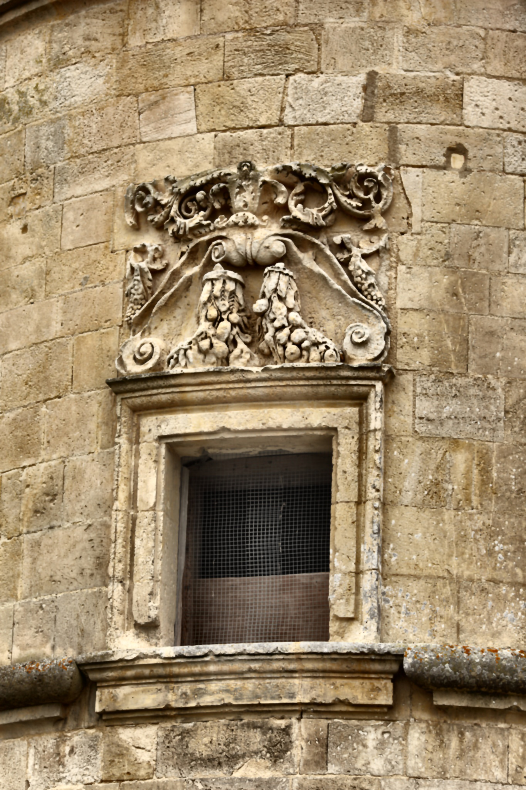
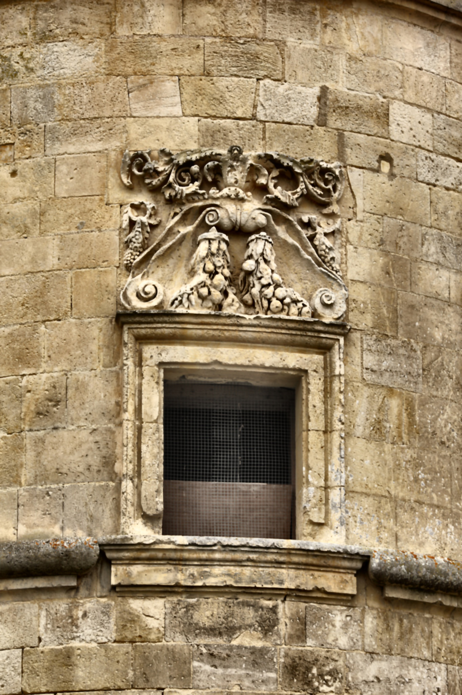
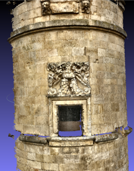
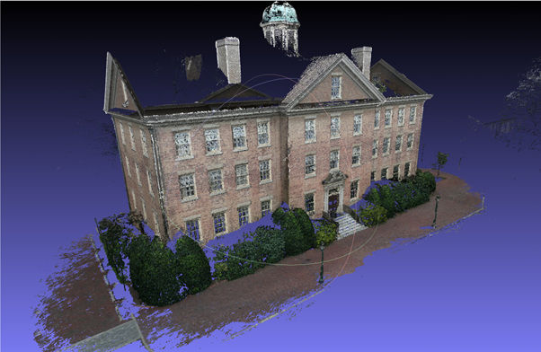

# 🧠 PointLab – Image2Model  
PointLab – Image2Model is a research-driven engineering project that transforms 2D photographs into accurate, metric 3D point clouds and mesh reconstructions. By integrating classical image preprocessing with advanced Structure-from-Motion (SfM) and Multi-View Stereo (MVS) algorithms through COLMAP, PointLab provides high-fidelity model generation directly from standard camera imagery.  

Our mission is to streamline the 3D reconstruction workflow for research, education, and industrial applications — making the process transparent, explainable, and reproducible. From preprocessing (contrast enhancement, denoising, sharpening, segmentation) to dense fusion, every step in PointLab is modular, parameter-controlled, and optimized for precision and performance.


This system was developed as part of an academic research project focusing on enhancing the accuracy, robustness, and clarity of 3D reconstruction through a well-designed image preprocessing module.

---

## 🧩 Key Features
- 📷 **Upload multiple images** via a clean web interface  
- 🧮 **Automatic preprocessing** using OpenCV (CLAHE, Gaussian Blur, Sharpening, Median, Morphology, Edges)  
- 🧱 **3D reconstruction** using COLMAP (SfM + MVS)  
- 🧩 **Real-time progress streaming** in browser  
- 💾 **Downloadable final 3D model** (.PLY format)  
- 📊 Transparent intermediate results for analysis  

---

## 🧠 System Architecture
The architecture consists of three major modules:

1. **Preprocessing Module** – Normalizes illumination, enhances contrast, and removes noise using OpenCV.  
2. **3D Reconstruction Module** – Uses COLMAP to compute camera poses (SfM) and dense 3D geometry (MVS).  
3. **Visualization & Output Module** – Web-based dashboard built with Flask for interactive feedback and downloading results.

---

## ⚙️ Setup Guide

### 🐧 **Ubuntu 22.04 / WSL2 (Recommended)**
This setup is easiest because COLMAP is natively supported.

#### **Step 1: Install dependencies**
```bash
sudo apt update
sudo apt install python3 python3-pip colmap
pip install flask pillow numpy opencv-python
```

#### **Step 2: Run the Flask server**
```bash
python3 app.py
```
#### **Step 3: Access in browser**
```bash
Visit http://localhost:5000
```

### 🪟 **Windows**

#### **Step 1: Install Python**
Download Python (≥3.10) from
```bash
https://www.python.org/downloads/
During installation, tick ✅ “Add to PATH”.
```
#### **Step 2: Install Python libraries**
Open Command Prompt:
```bash
pip install flask pillow numpy opencv-python
```
#### **Step 3: Install COLMAP**
1. Download the Windows build from the official page:
```bash
https://colmap.github.io/install.html
```
2. Extract and add the folder path (e.g., C:\Program Files\COLMAP) to System PATH:
```bash
Search “Environment Variables” → Edit PATH → Add new → Paste path.
```
3. Test installation:
```bash
colmap -h
```
#### **Step 4: Run the Flask app**
```bash
python3 app.py
```
#### **Step 5: Access in browser**
```bash
Visit http://localhost:5000
```

---

## 🧮 Pipeline Description
The **PointLab – Image2Model** pipeline integrates image enhancement with geometric 3D reconstruction to ensure that every image is radiometrically balanced and geometrically consistent before model generation.  
It improves texture clarity, reduces lighting variance, and enhances feature stability — resulting in more accurate and complete 3D outputs.

### 🧩 Step-by-Step Process
1. **Image Upload** – Users upload multiple overlapping images of an object or scene.  
2. **Preprocessing** – OpenCV operations (CLAHE, Gaussian Blur, Sharpening, Median, Morphology, Edges) are applied sequentially to refine contrast, reduce noise, and highlight structural regions.  
3. **3D Reconstruction (COLMAP)** – Automated Structure-from-Motion (SfM) and Multi-View Stereo (MVS) stages reconstruct a dense 3D point cloud model.  
4. **Visualization** – Processed outputs and final `.ply` files can be downloaded or visualized through the Flask interface.

---

## 🧱 Reconstruction Stages (COLMAP Workflow)
The 3D reconstruction pipeline in PointLab automates the **COLMAP** workflow through Python. Each stage progressively refines structure, pose, and depth for a metrically accurate model.

| Stage | Description | Output |
|--------|--------------|---------|
| **1. Feature Extraction** | Detects SIFT keypoints and computes descriptors for all input images. | `database.db` |
| **2. Feature Matching** | Performs pairwise matching with Lowe’s ratio test and RANSAC. | Verified correspondences |
| **3. Sparse Reconstruction (Mapper)** | Estimates camera intrinsics, extrinsics, and triangulates 3D points. | Sparse model |
| **4. Model Conversion** | Converts binary reconstruction data into TXT/PLY format. | `model.txt` / `model.ply` |
| **5. Image Undistortion** | Corrects lens distortions for accurate stereo matching. | Rectified images |
| **6. PatchMatch Stereo** | Computes per-pixel depth maps using photo-consistency. | Depth maps |
| **7. Stereo Fusion** | Merges all depth maps into a dense and colored 3D model. | `fused.ply` |

This automated sequence ensures that the transition from raw images to 3D structure remains robust, consistent, and fully traceable.

---

## 🚀 Future Enhancements
The current implementation focuses on modularity, interpretability, and performance. Future versions aim to:
- ⚡ Implement **GPU-accelerated PatchMatch** for faster dense reconstruction.  
- 🧠 Integrate **Instant-NGP** and **3D Gaussian Splatting** for hybrid neural rendering.  
- ☁️ Deploy a **cloud-hosted version** using Render, Deta, or AWS Lambda.  
- 🧩 Add **real-time visualization** via WebGL or Three.js.  
- 🧮 Provide **user-tunable preprocessing parameters** within the web interface.

---

## 👨‍💻 Contributors

**Raj Kothari** 
**Bhavya Sanghrajka**
**Harsh Maru**

Together, the team built, tested, and documented the **PointLab – Image2Model** system as a unified research initiative combining vision and geometry.

---

## ⚖️ License
This project is licensed under the **MIT License**, allowing open academic and research use.

---

## 🖼️ Output Images (Example Results)
#### Original
<p align="left">
  
  
  
  
</p>

#### Histogram Equalized
<p align="left">
  
  
  
  
</p>

#### Gaussian Blur
<p align="left">
  
  
  
  
</p>

#### Sharpened
<p align="left">
  
  
  
  
</p>

#### Median Filtered
<p align="left">
  
  
  
  
</p>

#### Morphological Cleaned
<p align="left">
  
  
  
  
</p>

#### Edges (Canny)
<p align="left">
  
  
  
  
</p>

#### Final Processed
<p align="left">
  
  
  
  
</p>

---

### Final 3D model




Download the final model: [full_castle.ply](full_castle.ply){:target="_blank"}
Download the South Building (128 HD images) model: [south_building.ply](south_building.ply){:target="_blank"}
